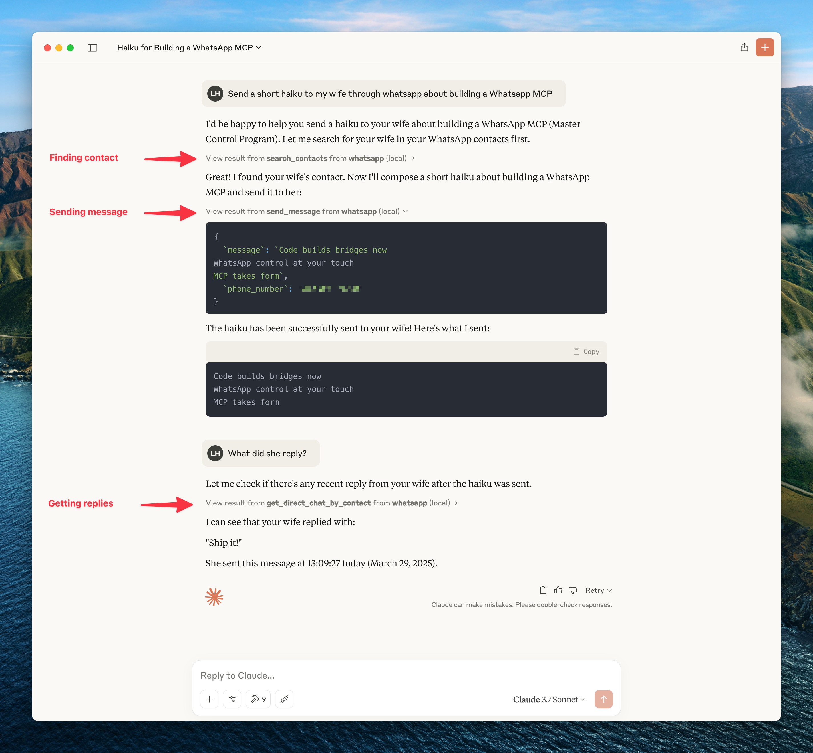

# WhatsApp MCP Server with Wati API

This is a Model Context Protocol (MCP) server for WhatsApp using the Wati API.

With this you can search and read your WhatsApp messages, search your contacts, and send messages to individuals. You can also send media files including images, videos, documents, and audio messages.

It connects to your WhatsApp account through the official Wati API. Messages are fetched from the API when accessed through the MCP tools and only sent to an LLM (such as Claude) when the agent accesses them through tools (which you control).

Here's an example of what you can do when it's connected to Claude.



> To get updates on this and other projects I work on [enter your email here](https://docs.google.com/forms/d/1rTF9wMBTN0vPfzWuQa2BjfGKdKIpTbyeKxhPMcEzgyI/preview)

## Installation

### Prerequisites

- Python 3.6+
- Anthropic Claude Desktop app (or Cursor)
- UV (Python package manager), install with `curl -LsSf https://astral.sh/uv/install.sh | sh`
- Wati API access (you'll need your tenant ID and authentication token)

### Steps

1. **Clone this repository**

   ```bash
   git clone https://github.com/lharries/whatsapp-mcp.git
   cd whatsapp-mcp
   ```

2. **Configure the Wati API**

   Copy the example environment file and edit it with your Wati API credentials:

   ```bash
   cd whatsapp-mcp-server
   cp .env.example .env
   # Edit .env with your Wati API credentials
   ```

   You need to set the following values in the `.env` file:
   - `WATI_API_BASE_URL`: The base URL for the Wati API (usually https://api.wati.io)
   - `WATI_TENANT_ID`: Your Wati tenant ID
   - `WATI_AUTH_TOKEN`: Your Wati authentication token

3. **Connect to the MCP server**

   Copy the below json with the appropriate {{PATH}} values:

   ```json
   {
     "mcpServers": {
       "whatsapp": {
         "command": "{{PATH_TO_UV}}", // Run `which uv` and place the output here
         "args": [
           "--directory",
           "{{PATH_TO_SRC}}/whatsapp-mcp/whatsapp-mcp-server", // cd into the repo, run `pwd` and enter the output here + "/whatsapp-mcp-server"
           "run",
           "main.py"
         ]
       }
     }
   }
   ```

   For **Claude**, save this as `claude_desktop_config.json` in your Claude Desktop configuration directory at:

   ```
   ~/Library/Application Support/Claude/claude_desktop_config.json
   ```

   For **Cursor**, save this as `mcp.json` in your Cursor configuration directory at:

   ```
   ~/.cursor/mcp.json
   ```

4. **Restart Claude Desktop / Cursor**

   Open Claude Desktop and you should now see WhatsApp as an available integration.

   Or restart Cursor.

## Architecture Overview

This application consists of one main component:

1. **Python MCP Server** (`whatsapp-mcp-server/`): A Python server implementing the Model Context Protocol (MCP), which provides standardized tools for Claude to interact with WhatsApp data through the Wati API.

### Communication with Wati API

- The MCP server communicates with WhatsApp through the Wati API
- All requests are authenticated using your Wati API credentials
- The API handles the connection to your WhatsApp account

## Usage

Once connected, you can interact with your WhatsApp contacts through Claude, leveraging Claude's AI capabilities in your WhatsApp conversations.

### MCP Tools

Claude can access the following tools to interact with WhatsApp:

- **search_contacts**: Search for contacts by name or phone number. Returns all available contact information including name, phone number, WhatsApp ID, status, creation date, and custom parameters.
- **list_messages**: Retrieve messages with optional filters and context
- **list_chats**: List available chats with metadata
- **get_chat**: Get information about a specific chat
- **get_direct_chat_by_contact**: Find a direct chat with a specific contact
- **get_contact_chats**: List all chats involving a specific contact
- **get_last_interaction**: Get the most recent message with a contact
- **get_message_context**: Retrieve context around a specific message
- **send_message**: Send a WhatsApp message to a specified phone number
- **send_file**: Send a file (image, video, raw audio, document) to a specified recipient
- **send_audio_message**: Send an audio file via WhatsApp
- **download_media**: Download media from a WhatsApp message and get the local file path
- **send_interactive_buttons**: Send a message with interactive buttons for user responses

### Media Handling Features

The MCP server supports both sending and receiving various media types:

#### Media Sending

You can send various media types to your WhatsApp contacts:

- **Images, Videos, Documents**: Use the `send_file` tool to share any supported media type.
- **Audio**: Use the `send_audio_message` tool to send audio files, which will be sent as regular files via the Wati API.

#### Media Downloading

To download media from a message, use the `download_media` tool with the filename (provided in the media message metadata). The tool will download the media file and return the local file path, which can then be opened or passed to another tool.

### Interactive Buttons Feature

The MCP server supports sending interactive messages with buttons, allowing your WhatsApp contacts to respond with predefined options:

#### Interactive Buttons

You can send customized interactive messages with up to 3 buttons:

```
send_interactive_buttons(
    recipient="85264318721",
    body_text="Would you like to proceed with your order?",
    buttons=[
        {"text": "Yes, proceed", "id": "proceed"},
        {"text": "No, cancel", "id": "cancel"},
        {"text": "Contact support", "id": "support"}
    ],
    header_text="Order Confirmation",
    footer_text="Thank you for shopping with us!",
    header_image="https://example.com/product.jpg"
)
```

These interactive messages enhance the user experience by providing structured response options rather than requiring free-text replies.

## Technical Details

1. Claude sends requests to the Python MCP server
2. The MCP server makes authenticated API calls to the Wati API
3. The Wati API communicates with WhatsApp's backend
4. Data flows back through the chain to Claude
5. When sending messages, the request flows from Claude through the MCP server to the Wati API and then to WhatsApp

## Troubleshooting

- If you encounter permission issues when running uv, you may need to add it to your PATH or use the full path to the executable.
- Make sure your Wati API credentials are correctly configured in the `.env` file.
- If you cannot connect to the Wati API, check that your credentials are valid and that your Wati account is active.

### API Issues

- **Invalid Credentials**: If you're seeing authentication errors, double-check your tenant ID and API token.
- **Rate Limiting**: The Wati API may have rate limits. If you're hitting these limits, you may need to wait or contact Wati support.
- **Media Upload Failures**: If you're having trouble uploading media, check that the file type is supported by WhatsApp and that the file isn't too large.

For additional Claude Desktop integration troubleshooting, see the [MCP documentation](https://modelcontextprotocol.io/quickstart/server#claude-for-desktop-integration-issues). The documentation includes helpful tips for checking logs and resolving common issues.
